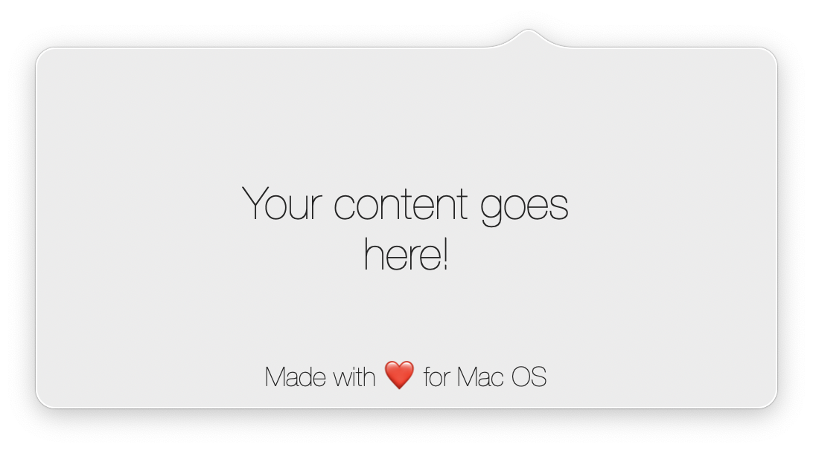
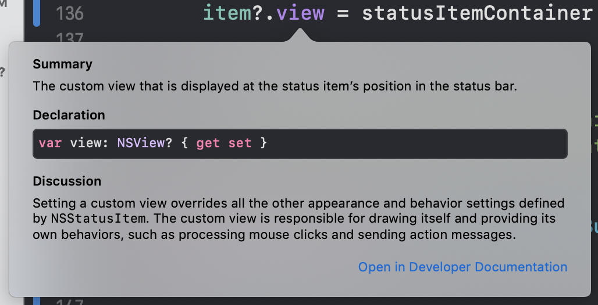

While exploring Cocoa and AppKit I have decided to make my drop-in replacement for NSPopover where I can set such things as custom background color, border color, popover corner radius, and other properties.

The idea was to encapsulate the whole logic in one class with just a few simple public methods. So setting an NSStatusItem, drawing a window, handling clicks, all should be inside one class. And here is my [implementation](https://github.com/iSapozhnik/Popover)

Now coming back to the topic 🧐 In my implementation I wanted to be able to show not only static NSImage as an NSStatusItem but also some custom views. There are multiple ways to do that.

### 1.Using `.view` property

NSStatusItem has a very nice property that we can use for that purpose. We can do something like that:

```swift
private func configureStatusBarButton(with view: NSView) {
    // 1
    item = NSStatusBar.system.statusItem(withLength: NSWidth(view.bounds))
    
    // 2
    let statusItemContainer = StatusItemContainerView()
    statusItemContainer.embed(view)
    
    // 3
    item?.view = statusItemContainer
}
```

This code is pretty straight forward. What we are doing here is the following:
 
1. we are creating a new instance of NSStatusItem with fixed width which is equal to our custom view's width. (`item` is an optional property to hold `NSStatusItem` for other needs. That's why in step 3 it has a question mark.)
2. here I'm using `StatusItemContainerView` just for layout purpose. Inside this class, I'm adding our custom view as a subview and layout to be in the center of the `StatusItemContainerView`.
3. Setting our container view to be a status item's view.

Now if you run this code you will see your beautiful custom view sitting in the menu bar. But wait... Have you tried to click it? Nothing will work and here is why:



Well, we all know that developers are lazy (are we? 😉) and, I don't know how you guys, but I don't want to implement all of that appearance, mouse clicks and other features by myself. But what other options do we have?

### 2. Using `.button` property

So we agreed that we want to use system features such as processing mouse clicks, sending action messages, etc. What if we will just add our custom menu bar view on top of status item's `.button` property?

```swift
private func configureStatusBarButton(with view: NSView) {
    item = NSStatusBar.system.statusItem(withLength: NSWidth(view.bounds))
    
    // 1
    guard let button = item.button else { return }
    button.target = self
    button.action = #selector(handleStatusItemButtonAction(_:))

    // 2
    let statusItemContainer = StatusItemContainerView()
    statusItemContainer.embed(view)
    button.addSubview(statusItemContainer)
}
```

1. Since `.button` property is optional, we need to unwrap it first. Then setting target and action. Without that left mouse click won't work. 
2. And the last step - adding our custom view as a subview on top of the status item button.

Ok, cool! Now everything works. Clicking on our custom status item will trigger an action. But what if now we want to handle another mouse event? Let's say by doing right mouse click we want to show an `NSMenu`?

Well luckily for us there is another property of NSStatusItem we can use. This property is called... guess what? Yeah, right, it's `.menu`. The problem here would be that NSStatusItem can not handle `.button` and `.menu` at the same time. Either one of these two options will work. So if you set `.menu` the property then whenever you click the status item - the system will show you the menu. And `handleStatusItemButtonAction(_:)` method we defined before won't be triggered. 

And now the question is: **how can we have at the same time NSMenu and a custom view as a status item, showing them independently from each other and triggering their actions by clicking left and right mouse?** Honestly, I don't know the right way 🤷🏼‍♂️ But, I believe, the approach I came up with is good enough. It works, so let's dive into it!

## EventMonitor for the rescue!
Let me describe the idea first and then we will switch to code. So the idea is to use `NSEvent.addLocalMonitorForEvents(matching: [.leftMouseDown, .rightMouseDown], handler: { ... })` to "observe" when the user performs right mouse click and before passing this event next to all other receivers, we just need to set the menu. Then, when this event reaches the status item, the system will show our beautiful menu. When the user clicks somewhere else or will pick any of the menu options, the system will hide the menu and then the `NSMenuDelegate` method `menuDidClose(_:)` will be called where we just need to set our status item menu back to nil. Sounds easy, isn't it?

<details>
<summary>Event monitor implementation</summary>

## EventMonitor.swift

```swift
import Cocoa

class EventMonitor {
    enum MonitorType {
        case global
        case local
    }

    typealias GlobalEventHandler = (NSEvent?) -> Void
    typealias LocalEventHandler = (NSEvent?) -> NSEvent?

    private var monitor: Any?
    private let mask: NSEvent.EventTypeMask
    private let monitorType: MonitorType
    private let globalHandler: GlobalEventHandler?
    private let localHandler: LocalEventHandler?

    init(monitorType: MonitorType, mask: NSEvent.EventTypeMask, globalHandler: GlobalEventHandler?, localHandler: LocalEventHandler?) {
        self.mask = mask
        self.monitorType = monitorType
        self.globalHandler = globalHandler
        self.localHandler = localHandler
    }

    deinit {
        stop()
    }

    func start() {
        switch monitorType {
        case .global:
            startGlobalMonitor()
        case .local:
            startLocalMonitor()
        }
    }

    func stop() {
        guard let monitor = self.monitor else { return }

        NSEvent.removeMonitor(monitor)
        self.monitor = nil
    }

    private func startGlobalMonitor() {
        guard let handler = globalHandler else {
            assertionFailure("Global event handler is not set.")
            return
        }
        monitor = NSEvent.addGlobalMonitorForEvents(matching: mask, handler: handler)
    }

    private func startLocalMonitor() {
        guard let handler = localHandler else {
            assertionFailure("Local event handler is not set.")
            return
        }
        monitor = NSEvent.addLocalMonitorForEvents(matching: mask, handler: handler)
    }
}

```

</details>

Above you can find Event monitor implementation which wraps both local and global monitors into a nice, easy to use, wrapper. First thing first we need to start monitoring for local events:

```swift
private func setupMonitors() {
    // 1
    localEventMonitor = EventMonitor(mask: [.leftMouseDown, .rightMouseDown], globalHandler: nil, localHandler: { [weak self] event -> NSEvent? in
        guard let self = self, let currentEvent = event else { return event }
        
        // 2
        let isRightMouseClick = currentEvent.type == .rightMouseDown
        let isControlLeftClick = currentEvent.type == .leftMouseDown && currentEvent.modifierFlags.contains(.control)
        if isRightMouseClick || isControlLeftClick {
            self.item.menu = self.menu
        }
        
        // 3
        return event
    })
}
```
*Don't forget to call `startLocalMonitor` method if you are going to use my implementation of the EventMonitor. Check [here](https://github.com/iSapozhnik/Popover) for reference.*

1. We create a new instance of the monitor which "observes" left and right mouse clicks. I know that we need only the right-click, but keep in mind that you can also perform CTRL+Left click which is equivalent to the right mouse click. Now, since we are interested only in local events, we need to pass a closure to `localHandler` parameter.
2. We make two constants to understand whether it's a right-click or it's a control-click and if one of these two constants is `true` we set our menu.
3. Here we just returning our event without any modifications.

And that's it. Left clicks now are going to trigger `handleStatusItemButtonAction(_:)` but right-clicks will show a menu!

I hope this was helpful and if you have any questions you can always reach me at Twitter [@iSapozhnik](https://twitter.com/iSapozhnik) 😉
