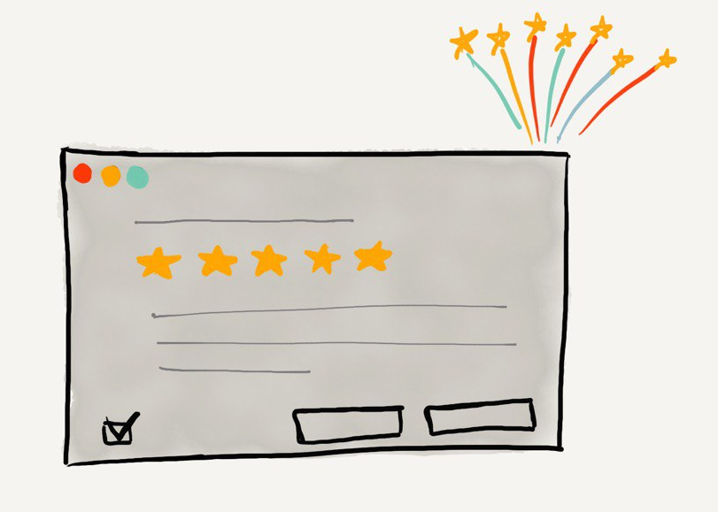
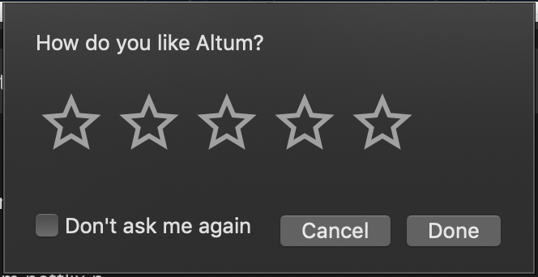
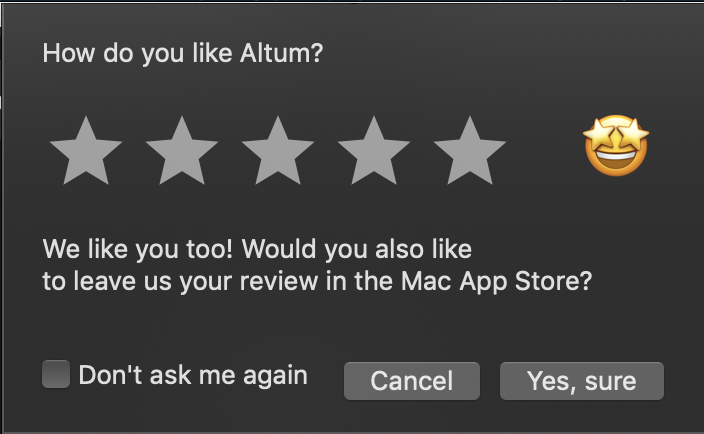
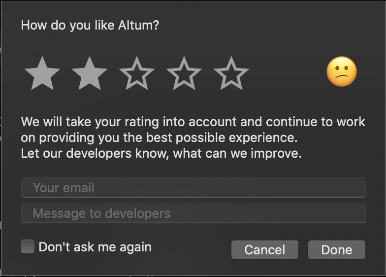

When we releasing a new app the last thing we want to see is either bad reviews or no reviews at all. Unfortunately most of the time a user will write a negative review if he does not like something or if something does not work as expected. Only a few percents of all your app users will write positive feedback by themselves. Luckily since iOS 10.3 and macOS 10.14 (why so late?!) Apple has something for us:  `SKStoreReviewController`.

This tiny class is super straight forward to use! It has only one class method `requestReview()` and it takes care of everything you need: it has some neat UI, it handles the entire process for you. Cool, huh? But let’s talk about the downsides of this approach.

## Bad strategy 
While using `SKStoreReviewController` we are fully responsible when to show a review prompt. Which means there should be a strategy behind. Imagine the case when you are trying to ask your user for review during hist first minutes exploring your app. Most probably he will ignore this prompt. Or imagine another case. The user has failed many times in a row finishing some level in your game. And now you are asking for a review. Guess how many starts will he put? So without a good strategy **when** to ask users for a review there is a big chance that this tool may work against you.

## Reliability 
Even though on iOS it works pretty well and I haven’t heard of any issues with that class, on macOS Mojave and Catalina it’s not that smooth.
<!--
--><blockquote class="twitter-tweet">
I’ve had a couple of users reporting that SKStoreReviewController is being presented either way too often or in some sort of loop in macOS (Catalyst). Has anyone ever seen this issue? Maybe <a href="https://twitter.com/stroughtonsmith?ref_src=twsrc%5Etfw">@stroughtonsmith</a>? I can’t seem to find anything online and I’ve never faced it myself 😔 <a href="https://t.co/qrFwTsNFK2">pic.twitter.com/qrFwTsNFK2</a>
&mdash; Xavi Moll (@xmollv) <a href="https://twitter.com/xmollv/status/1264185474299703298?ref_src=twsrc%5Etfw">May 23, 2020</a></blockquote> 
People had some bad ratings just because `SKStoreReviewController`  was presented either too often or in some cases sort of a loop. Another problem was in macOS Mojave and while presenting review prompt instead of an app name sometimes it was just a `(null)`. Even though it’s not a super critical issue but overall it makes a kind of a feeling that the app is buggy.

## But what we, developers, can do?
Well, luckily for us Apple has provided another way to review the app. We can deep link our user to a specific URL: `https://itunes.apple.com/app/idXXXXXXXXXX?action=write-review` where he can leave us 5 stars and some kind words.  But this approach will require a bit of work since now we are responsible for the UI. But there is one huge benefit which I going to show you in second. In this article, I’m going to show a macOS example but the same technique applies to iOS apps.

I’m going to start by implementing this little window

I didn’t want to invent the wheel so I decided to use the Rating component from Apple. Here is an example code: [Start Developing iOS Apps (Swift): Implement a Custom Control](https://developer.apple.com/library/archive/referencelibrary/GettingStarted/DevelopiOSAppsSwift/ImplementingACustomControl.html). As you can see since now we are more flexible in terms of UI I have also added `Don't ask again` checkbox. It’s a nice little feature that the user can benefit from. 

Now if the user rates our app 4 and higher we can thank him and ask to review the app in the store. From my experience, the majority of users will proceed next and give the same rating on the App Store. 

But what if for some reason the user didn’t like that app or something did not work as expected or any other reason which makes him rate your awesome app less than 4? At this moment we can turn his negative feedback in something useful for us!

Now, as you can see, instead of letting our user put all his anger into a bad review on the Store we can try to ask him what exactly we should improve. Obviously, this step will not protect us 100% from bad reviews but at least will help us understand better our users and their needs. 

The last step would be to send this data to us. If your app is working online and is doing some network requests it should not be a big deal to add one more endpoint in your backend. But what if you are developing an offline app? In my case,  [Altum (@AltumApp) | Twitter](https://twitter.com/AltumApp?s=20) is exactly this kind of an app. I’m pretty sure there are other ways to handle user input but I decided to use [Email Delivery Service](https://sendgrid.com) service. The service offers tons of free emails and has some really simple API. In the end, all the feedback will end up in our email box, sweet! And one more thing. Since now you are in charge of what we are going to send to the service you can include a bunch of technical information and debug. From the top of my mind:

- OS version
- App version
- any other information which can help you understand what caused the problem.

Even though this approach requires a bit more work and not just fire-and-forget, in the end, both parties can benefit from it. The developer will have a chance to fix an issue before it appears on the Store. The user will have a chance to communicate all his problems directly to a dev team.

I hope this was helpful and if you have any questions you can always reach me at Twitter [@iSapozhnik](https://twitter.com/iSapozhnik) 😉
