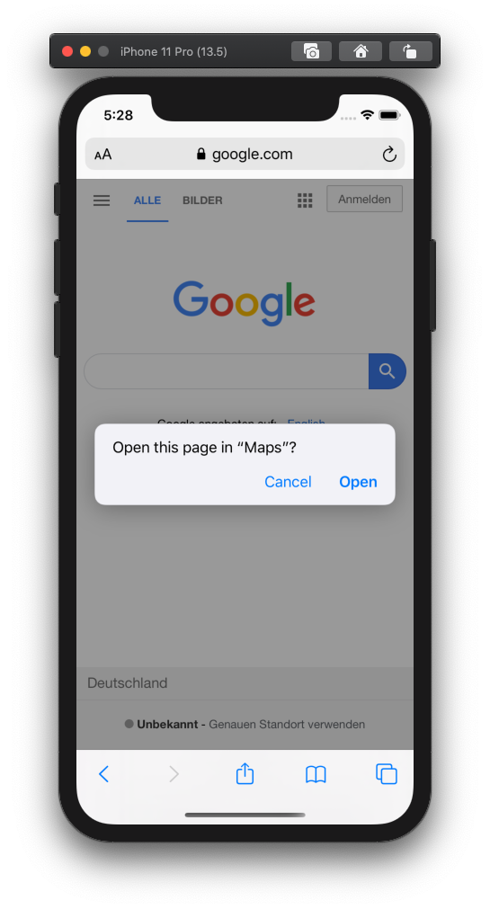

# The Problem

From time to time we need to deal with deeplinks and universal links in our apps. We want to have better integration with the system and also we want to provide more convenience to our customers. Here are some typical use cases for universal links:

- marketing emails can immediately redirect users to the app;
- web sites can also redirect users to the app;

For that reason supporting deeplinks in your app is something that your customers and you as a developer will benefit from. But debugging deeplinks on iOS is not that convenient. Here I'm going to cover **6 different ways of launching universal and deeplinks on iOS platform** starting from the most obvious all the way to not that obvious.

# 1. Using the Safari app

Every iOS simulator comes with a bunch of apps. One of them is a well-known web browser - Safari. I think every iOS developer who has been dealing with deeplinks knows this approach. You just run Safari, enter or paste a link into the URL text field and you are done. The system will ask if you really want to open that link using **<yout app goes here>**. Tap Open and you are ready to go!

### Pros:
- super easy to use
- does not require any additional work/setup

### Cons:
- takes time to switch "your app <—> Safari app"
- time-consuming when it comes to testing multiple links
- if you accidentally tap on Cancel, Safari will keep telling you "Safari cannot open the page because the address is invalid". Which is completely not true

# 2. Using the Calendar app

Another application that every iOS simulator does have is the Calendar app. You may wonder "How the calendar can help me to open a deeplink?". Well, every calendar event has something we can utilize. Create a new event and while doing so you will notice that at the bottom of the screen there is "Notes" field. In the end, it's multiline UITextView which can also render URLs. Now, just add your links there and you are good to go!

### Pros:
- easy to use
- comes with every iOS simulator

### Cons:
- takes time to setup deeplinks or universal links
- for every simulator, you would need to do this setup over and over again
- requires to remember the day when the event has been created

# 3. Using the Shortcuts app

What does Apple say about the Shortcuts app?

> Shortcuts in iOS 12 let you get things done with your apps, with just a tap or by asking Siri. In addition to running shortcuts available on your iOS device, you can use the Shortcuts app to create custom shortcuts, simplifying everyday tasks by combining steps across multiple apps.

Well, that definitely sounds like something we can leverage! Start the app, tap on the plus button at the top right corner, tap on "Add Action", select "Web" action, and then Open URLs. Then enter your deeplink's URL and set the name for the shortcut. Easy, huh?

This approach is quite similar to the one before so Pros and Cons are also the same.

# 4. Using `simctl`

Now we are coming to a more advanced technique. Command Line Tools has one very interesting tool. `simctl` controls iOS, watchOS, tvOS, and iPadOS simulator instances as well as simulator settings such as time, battery level, and more. But also it has `openurl` command and that's exactly what we need. 

`xcrun simctl openurl booted 'http://maps.apple.com/?q=Mexican+Restaurant'`

This command will open the Maps app on the booted simulator and will show Mexican restaurants around. If you have multiple booted simulators then the system will pick one and use it. And you are out of the control which one is going to be used. If you want to explicitly say which simulator has to be used, then you have to specify it's udid. Run:

`xcrun simctl list devices --json`

to get the list of all simulators, pick the one you need and then run

`xcrun simctl openurl <udid> 'http://maps.apple.com/?q=Mexican+Restaurant'`.

### Pros:
- very versatile
- supports all simulators

### Cons:
- requires a bit of work to set up everything
- might not be comfortable if you not get used working with command-line tools
- there is no way to predefine all the links you are going to work with

# 5. Using the Automator app on macOS

Yeah, you read it right. We are going to use the Automator app to launch deeplinks on the iOS simulator. Automator is also available on every mac since it's part of standard macOS applications. There are a couple of ways to achieve what we want. I'm going to use Quick Actions since in that case, we can use any application to get URLs from. So, start the app, `File —> New —> Quick Action —> Choose`. Now drag and drop your first action. It's going to be `Set Value of Variable`. Go to the `View` menu and select `Variables`. Inside variables section make the right-click and select `New variable`. Name it something like `url`. We are going to keep input text (which is supposed to be our deeplink) in that variable. Now drag and drop `Run Shell Script` action, make sure that Pass input parameter set to "as arguments". Past the following script which we already familiar with:

`xcrun simctl openurl booted $1` where `$1` is going to be our URL variable.

Now save this action as "Open in Simulator". This action is now available in the Services context menu. Select any URL as a text in any app, right-click, Open in Simulator - neat right?

### Pros:
- highly integrated into the system
- easy to set up and use
- multiple links support

### Cons:
- not possible to use on multiple simulators

# 6. Using the Altum app

My favorite option btw. Creating deeplink groups, supporting multiple simulators (actually any simulator that is installed on the system), sharing configuration file with all the links with your colleagues, opening links on a real device, and much more. All of that is available in a simple, yet powerful app. It does one thing but it does it well. Besides all of these great features, the app can also fetch all your universal links directly from your website by utilizing Apple App Site Association file.

### Pros:
- too many

### Cons:
- none 😍
