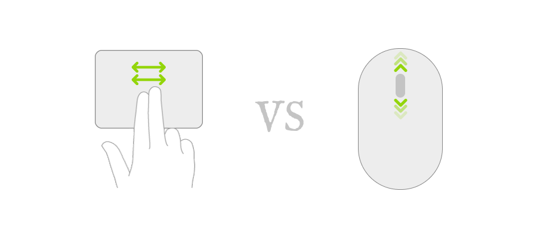

While working on a new app I had to do some hacky thing like swapping horizontal and vertical scroll of the scroll view. On the other hand, it makes total sense, and here is why.

In the app, I have one small window on top of the screen. I take the full width of the screen and height about 300 points. All the content is horizontally swipeable. While using a trackpad or magic mouse you typically won't have any issues with navigation. But with the normal mouse, it's a bit difficult since most mouses have only a one-axis scroll wheel. Which means you can not scroll horizontally. That's why my idea was to scroll NSScrollView horizontally while the user will perform a normal wheel scroll. Enough talking let's start coding!

To implement this behavior we will need to subclass `NSScrollView` and override `func scrollWheel(with event: NSEvent)` method. The first thing we need to do is to distinguish between mouse scroll and trackpad scroll. To do so we can use `NSEvent.EventSubtype` enum which has `.mouseEvent` value:

```
class MyScrollView: NSScrollView {
    override func scrollWheel(with event: NSEvent) {
        if event.subtype == .mouseEvent {
            // swap logic
        } else {
            super.scrollWheel(with: event)
        }
    }
}
```

Now, how can we actually change the direction? Unfortunately, we can not do anything with `NSEvent` itself (like changing it's `scrollingDeltaX` parameter). But what we can do, though, is to change its underlying `CGEvent` object. The final method will look like the following:

```
override func scrollWheel(with event: NSEvent) {
    if event.subtype == .mouseEvent {
        // 1
        if let cgEvent = event.cgEvent?.copy() {
            // 2
            cgEvent.setDoubleValueField(.scrollWheelEventDeltaAxis2, value: Double(event.scrollingDeltaY))
            // 3
            if let event = NSEvent(cgEvent: cgEvent) {
                super.scrollWheel(with: event)
            }
        } else {
            super.scrollWheel(with: event)
        }
    } else {
        super.scrollWheel(with: event)
    }
}
```

1. We try to get CGEvent from the event;
2. We set `scrollingDeltaY` value to `.scrollWheelEventDeltaAxis2` key of the CGEvent, which represents a horizontal scroll event;
3. In the last step we wrap `CGEvent` into `NSEvent` and call super.

That's it. Now if the user will scroll the wheel the content of the scrollView will move horizontally but the trackpad behavior will remain default.

Happy coding 🤘🏻